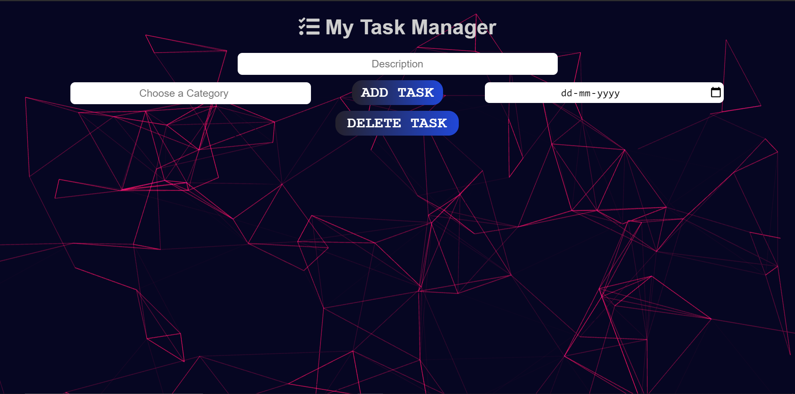
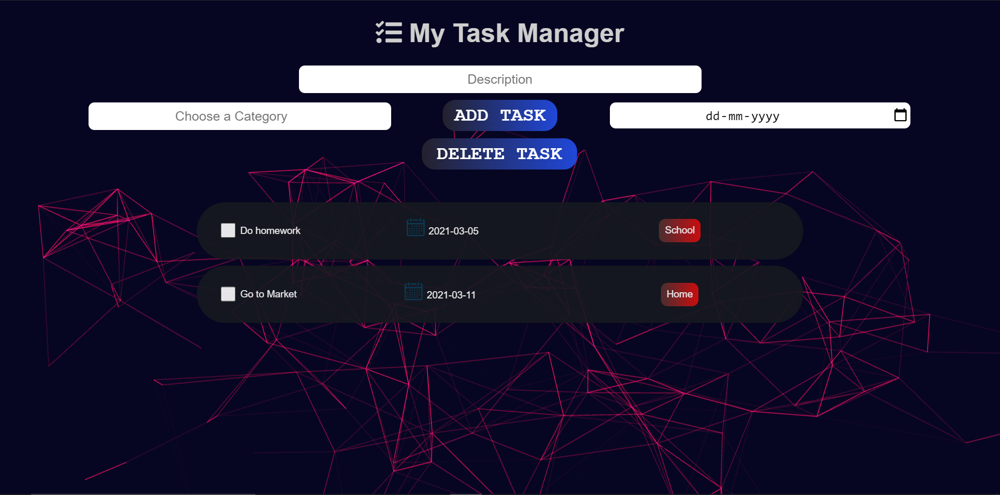

# Task-Manager
It is a basic TO-DO list web app made using NodeJS, ExpressJs, and MongoDB. You can add and delete tasks from this. Multiple deletions are also possible

<h2> Live Preview : http://saumya-todo.herokuapp.com/

# Instructions

1. Install NodeJs (nodejs.org).
2. Fork, Clone or download and open this repository in a terminal/command prompt.
3. Execute `npm install`.
4. Execute `npm start`.
5. Open your preferred web browser and go to `http://localhost:9000`.

# Features/Functionalities

1. Adding a Task
2. Deleting a Task. (Delete multiple tasks at once)
3. All the tasks are saved to the database (MongoDB, Mongoose is used for databases)
4. Dynamic background from Vanta JS

# Screenshots

